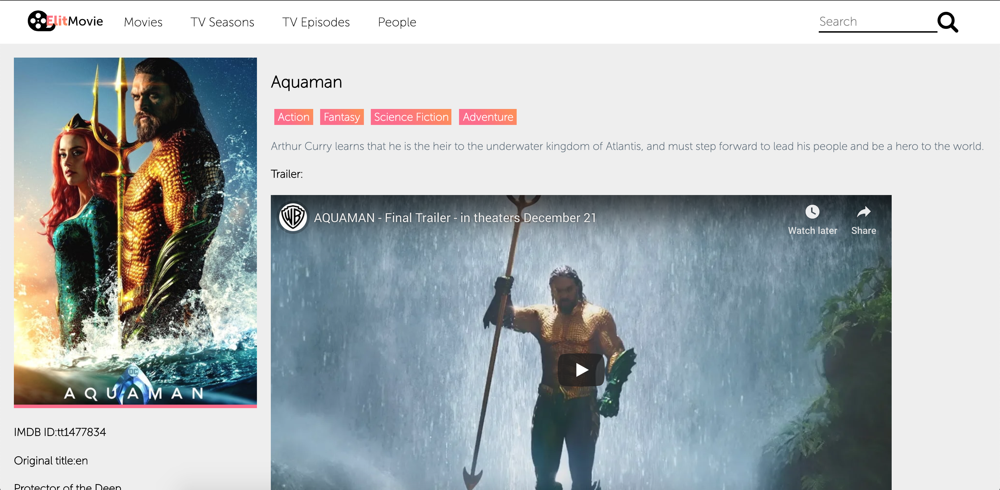

## MOVIE TMDB APP

This is the second version of Movie app made by using [TMDB API](https://developers.themoviedb.org/3). This version was made using Redux Saga instead of Redux Thunk that was used before. 

**You can see previous version using this [link](https://github.com/IKhumoyun/movie-tmdb)**

### `npm start`

Runs the app in the development mode. 
Open [http://localhost:3000](http://localhost:3000) to view it in the browser.

### Main Page

Main page of the project looks like the where you can find popular movies list

You can click and open individual movie page where you can:

- See credits to the movie
- Watch trailer of the movie
- Short information about the movie
- And recommendations to the movie

**Done**

1.  React
2.  React-router
3.  Redux (Middle)
4.  Redux Saga / Redux Observable (Middle)
5.  Use CSS in JS library to style (Middle)
6.  Clean commit history (Middle)

**Should be done**

7.  Typescript (Middle)
8.  Cover project with unit tests (Middle)
9.  Configure Babel  and Webpack manually (Senior)